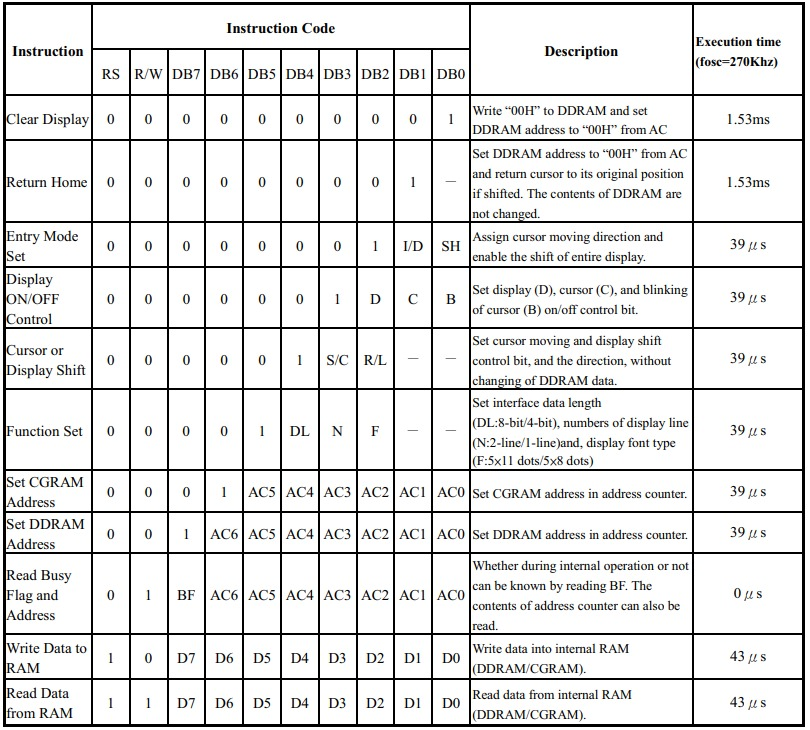
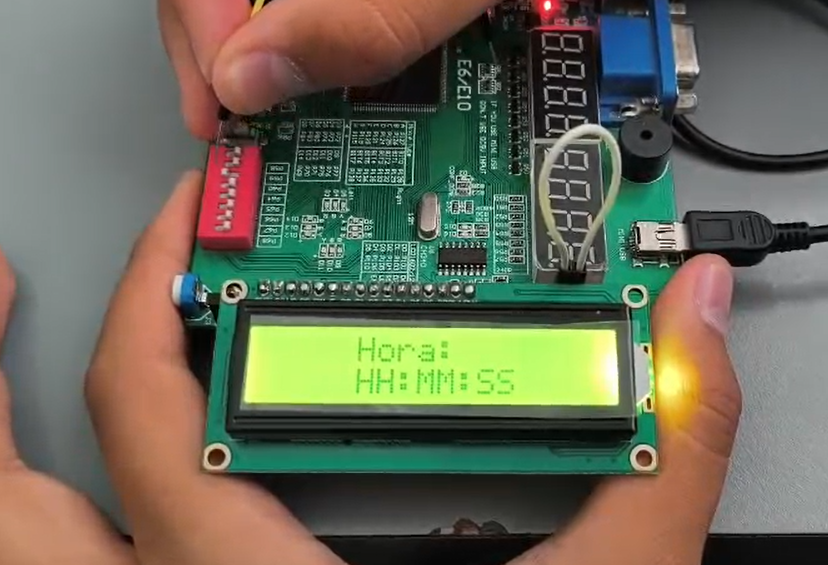

# Visualización usando pantalla LCD 16x2 en modo paralelo
## Datos de los estudiantes
- Juan David Rodriguez – juarodriguezhe@unal.edu.co
- Miguel Angel Alvarado – mialvarados@unal.edu.co
- Juan Pablo Castañeda – jucastanedamo@unal.edu.co
- Fecha: 26/06/2026

## Descripción
### Pantalla LCD 16x2
Una pantalla LCD 16x2 tiene 16 columnas y 2 filas, cada carácter se forma en una matriz de 5x8 píxeles. La comunicación con la FPGA se hace en paralelo usando las señales RS (comando/dato), R/W (lectura/escritura) y E (enable). En este laboratorio se usó en modo de 8 bits con los pines D0-D7.

Para controlarla se requiere ejecutar una secuencia de comandos de inicialización (function set, entry mode, display on/off, clear display) y luego escribir los caracteres en cada línea. Todo esto se manejó con una máquina de estados para mantener el flujo ordenado.
### Máquina de Estados FSM
La FSM tiene 5 estados: `IDLE`, `CONFIG_CMD1` (envía los 4 comandos de inicialización), `WR_STATIC_TEXT_1L` (escribe 16 caracteres en línea 1), `CONFIG_CMD2` (posiciona cursor en línea 2) y `WR_STATIC_TEXT_2L` (escribe 16 caracteres en línea 2). Un divisor de frecuencia reduce los 50 MHz de la FPGA a ~16 ms para cumplir con los tiempos que exige la LCD.

### Datos de los caracteres
Cada línea tiene 16 caracteres y cada carácter se representa con 8 bits en ASCII, por lo que se necesitan 128 bits por línea. Estos se almacenan como constantes `localparam [127:0]` en el código. Se definieron 4 mensajes distintos y un switch de 2 bits (`sw`) selecciona cuál mostrar, permitiendo cambiar entre ellos sin reiniciar la FPGA.

### Hoja de datos
Para este laboratorio se revisó en detalle la hoja de datos de la LCD 16x2. Allí hay una tabla de especificaciones técnicas que detalla el conjunto de instrucciones, los códigos de control correspondientes y los tiempos de ejecución para el controlador de la pantalla. Cada carácter se compone de 8 bits (8 parámetros), y cada línea tiene 16 caracteres, por lo que se necesitan 128 bits por línea. Con base en la tabla se determinaron los comandos de inicialización: function set (0x38), entry mode (0x06), display on/off (0x0C) y clear display (0x01), además del comando para posicionar el cursor al inicio de la segunda línea (0xC0).

  

## Objetivos
### Parte 1:
- Comprender el funcionamiento de una pantalla LCD 16x2 y su interfaz paralela
- Implementar una FSM para el control secuencial de la LCD
- Escribir texto estático en ambas filas
- Realizar simulación e implementación en la FPGA Cyclone IV

### Parte 2:
- Agregar selección de múltiples mensajes mediante interruptores
- Implementar la lógica para cambiar el contenido de la pantalla en tiempo real
- Posicionar el cursor usando comandos del datasheet
- Integrar el sistema completo en la FPGA

## Materiales
- Pantalla LCD 16x2
- Jumpers
- Fuente de laboratorio
- FPGA Cyclone IV
- Software Quartus

## Metodología
### Parte 1 Texto Estático en LCD:
Se implementó un controlador LCD con una máquina de estados de 5 estados. Al iniciar, la FSM pasa por `CONFIG_CMD1` donde envía secuencialmente los 4 comandos de inicialización usando un contador (`command_counter`). Luego en `WR_STATIC_TEXT_1L` escribe los primeros 16 caracteres de la memoria en la línea 1 con RS en 1 (modo dato). Después `CONFIG_CMD2` envía el comando 0xC0 para saltar a la segunda línea y finalmente `WR_STATIC_TEXT_2L` escribe los siguientes 16 caracteres.

El divisor de frecuencia usa un contador que llega hasta 800,000 para generar un clock de ~16 ms partiendo de 50 MHz, que gobierna tanto la FSM como la señal `enable` de la LCD. En la versión inicial (en `src/lcd1602_text.v`) los datos se cargaban desde un archivo .txt mediante `$readmemh` con mensajes como "Bateria 1" y "Bateria 2". El código de esta parte se puede revisar en [src/lcd1602_text.v](src/lcd1602_text.v).

### Parte 2 Mensajes Seleccionables por Switch:
Para la segunda parte se rediseñó el módulo para incluir una entrada `sw` de 2 bits que permite seleccionar entre 4 mensajes distintos. Se eliminó la dependencia de `$readmemh` y en su lugar se definieron los mensajes como constantes de 128 bits directamente en el código:

- **MSG0 (sw=00):** L1: "       Hora:   " / L2: "       HH:MM:SS   "
- **MSG1 (sw=01):** L1: "   Sirviendo    " / L2: "    Comida       "
- **MSG2 (sw=10):** L1: "    Falta       " / L2: "    Comida       "
- **MSG3 (sw=11):** L1: "     Modo       " / L2: "    Manual       "

Cada constante de 128 bits almacena 16 caracteres de 8 bits cada uno, y se cargan en la memoria (`static_data_mem`) mediante un lazo `for` que extrae cada byte usando `[127 - i*8 -: 8]`. Un registro `sw_prev` detecta cambios en el switch y solo recarga los datos cuando la FSM está en `IDLE`, evitando interrumpir un ciclo de escritura en curso.

El código de esta parte se puede revisar en [code/lcd1602_text.v](code/lcd1602_text.v).

## Resultados
### Parte 1 Texto Estático en LCD:
La pantalla se inicializa correctamente y muestra el mensaje en ambas líneas.

  

### Parte 2 Mensajes Seleccionables:
En el siguiente video se evidencia el funcionamiento del sistema donde se pueden cambiar los mensajes en la LCD usando los switches de la FPGA, demostrando la actualización en tiempo real del contenido:

<video src="img/video.mp4" controls width="640"></video>

## Conclusiones
- Se logró implementar el protocolo de comunicación de la LCD 16x2 en modo paralelo, donde la secuencia de inicialización y los tiempos entre comandos son críticos. El divisor de frecuencia a ~16 ms fue clave para que la FPGA (50 MHz) se comunicara correctamente con la LCD.
- La máquina de estados permitió estructurar el flujo de control de forma ordenada. Inicialmente intentamos manejar todo de forma secuencial pero la FSM con 5 estados separó claramente la configuración de la escritura, facilitando la depuración.
- Para la hoja de datos, se encontró una tabla de especificaciones técnicas que detalla el conjunto de instrucciones, los códigos de control correspondientes y los tiempos de ejecución. Cada línea de la LCD tiene 16 caracteres y cada carácter usa 8 bits, por lo que se necesitan 128 bits por línea, almacenados como constantes de 128 bits en el código. Los 4 comandos de inicialización (function set, entry mode, display on, clear display) se definieron según esa tabla.
- El switch de selección de mensajes permitió cambiar entre 4 modos distintos sin recompilar (Hora, Sirviendo, Falta, Manual), detectando cambios solo cuando la FSM está en IDLE para evitar corromper la transmisión.
- En la implementación física, la configuración del pin nCEO (pin 101) como I/O regular en las opciones de dispositivo de Quartus fue necesaria porque por defecto tiene función de programación. También se verificaron las señales con el osciloscopio para confirmar niveles de voltaje compatibles entre la FPGA (3.3V) y la LCD (5V).
